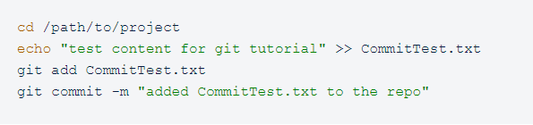

# ¿cómo inicializar un repositorio?
Este tutorial ofrece una visión general sobre cómo configurar un repositorio con el sistema de control de versiones Git. Se explicará cómo iniciar un repositorio de Git para un proyecto nuevo o existente.

Los puntos de mayor nivel que cubrirá esta guía son:
* Inicio de un nuevo repositorio de Git
* Clonación de un repositorio de Git existente
* Confirmación de la versión modificada de un archivo al repositorio
* Configuración de un repositorio de Git para la colaboración remota
* Comandos comunes de control de versiones de Git

### Inicio de un nuevo repositorio: git init
Para crear un nuevo repositorio, usa el comando *git init*. *git init* es un comando que se utiliza una sola vez durante la configuración inicial de un repositorio nuevo. Al ejecutar este comando, se creará un nuevo subdirectorio .git en tu directorio de trabajo actual. También se creará una nueva rama principal.

### Clonación de un repositorio existente: git clone
Si un repositorio ya se ha configurado en un repositorio central, el comando de clonación es la manera más común de obtener una copia de desarrollo local. Igual que git init, la clonación suele ser una operación única. Una vez que un desarrollador ha obtenido una copia de trabajo, todas las operaciones de control de versiones se administran por medio de su repositorio local.
**git clone <repo url>**

### Guardar cambios en el repositorio: git add y git commit
Ahora que has iniciado o clonado un repositorio, puedes realizar commits en la versión del archivo. Para el siguiente ejemplo asumiremos que has configurado un proyecto en /path/to/project. Los pasos son los siguientes:

1. Cambia el directorio a /path/to/project
2. Crea un archivo nuevo CommitTest.txt con el contenido "test content for git tutorial"
3. Ejecuta el comando git add para añadir CommitTest.txt al área de preparación del repositorio
4. Crea un commit nuevo con un mensaje que describa qué trabajo se ha hecho en el commit

Ejemplo:

---
Después de llevar este ejemplo, en el historial de tu repositorio se mostrará CommitTest.txt y se realizará el seguimiento de las actualizaciones futuras a este archivo.

En este ejemplo se han introducido dos comandos git adicionales: add y commit. Ha sido un ejemplo muy limitado, pero ambos comandos se tratan más en profundidad en las páginas sobre git add y git commit. El comando *git add* se suele usar con la opción --all. Al ejecutar **git add --all**, se añadirán todos los archivos con cambios y sin seguimiento al repositorio y se actualizará el árbol de trabajo.

---
##### Si tienes mas dudas consulta el siguiente video

