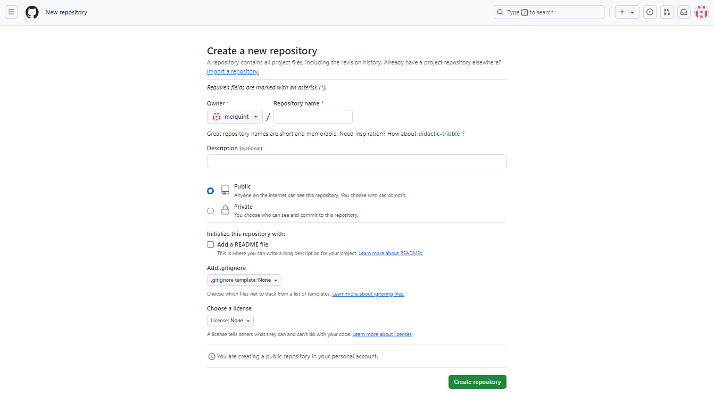
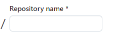
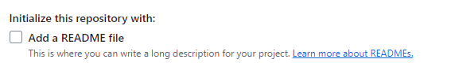

# Tutorial sobre Inicialización, Agregado y Subida de Archivos a GitHub con Git 

Este tutorial se hizo con la finalidad de ayudar a las personas que estan empezando en el mundo de la programacion. Aqui encontraras  los paso a paso sobre como inicializar un repositorio local, guardar sus cambios y llevarlos al repositorio remoto (GitHub).

---

Versionar archivos en un repositorio es fundamental ya que permite llevar un registro de todas las modificaciones realizadas en los archivos a lo largo del tiempo, esto facilita la identificación de cuándo se introdujeron cambios específicos y por quién. Además facilita el trabajo en equipo, ya que múltiples personas pueden trabajar en el mismo proyecto sin sobrescribir los cambios de los demás. Las herramientas de control de versiones ayudan a fusionar cambios de diferentes colaboradores. Tambien ayuda en caso de que si en un cambio hay algún error, puedes revertir fácilmente a una versión anterior del archivo, lo que ahorra tiempo y esfuerzo en la resolución de problemas. Esta permite crear ramas para probar nuevas características o realizar cambios sin afectar la versión principal del proyecto. Esto es útil para experimentar y desarrollar de manera segura.

## ¿Qué es Git y GitHub? 

### Git 
Git es un sistema de control de versiones de código abierto ideado por
Linus Torvalds (el padre del sistema operativo Linux) y actualmente es el
sistema de control de versiones más extendido.
A diferencia de otros SCV Git tiene una arquitectura distribuida, lo que
signica que en lugar de guardar todos los cambios de un proyecto en un
único sitio, cada usuario contiene una copia del repositorio con el historial
de cambios completo del proyecto. Esto aumenta signicativamente su
rendimiento.


[En este link encontraras mas informacion sobre Git](https://aprendeconalf.es/docencia/git/manual/manual-git.pdf )

### GitHub 
 Se trata de una de las principales plataformas para crear proyectos abiertos de herramientas y aplicaciones, y se caracteriza sobre todo por sus funciones colaborativas que ayudan a que todos puedan aportar su granito de arena para mejorar el código.

 Como buen repositorio, el código de los proyectos que sean abiertos puede ser descargado y revisado por cualquier usuario, lo que ayuda a mejorar el producto y crear ramificaciones a partir de él. Y si prefieres que tu código no se vea, también pueden crearse proyectos privados, pero para eso hay que crear una cuenta de GitHub, puedes hacerlo haciendo clic [aqui.](https://github.com/signup?ref_cta=Sign+up&ref_loc=header+logged+out&ref_page=%2F&source=header-home)

[En este link encontraras mas informacion sobre GitHub](https://www.xataka.com/basics/que-github-que-que-le-ofrece-a-desarrolladores)

## Pasos para inicializar un repositorio Git local

### 1. Instalación de Git

#### Windows
Lo primero es acceder a la pagina de descargas de Git, puedes hacerlo haciendo clic [aqui](https://git-scm.com/downloads), en este sitio encontraremos el link de descarga para cada los sistemas operativos mas usados, haremos clic en el nuestro y seleccionando el instalador.

### 2. Abrir la terminal en Visual Studio Code 

los pasos son :

- Abrir Visual Studio Code.
- Ve a la barra de menú.
- Haz clic en Ver > Terminal (o presiona Ctrl + ñ).
- Se abrirá la terminal integrada en la parte inferior.

#### a. Navegar en el Directorio:

Usa el comando cd para navegar hasta el directorio donde deseas crear el repositorio.
El comando cd, que significa "change directory" (cambiar directorio), se utiliza en la terminal de comandos para navegar entre diferentes directorios en el sistema de archivos. Aquí te dejo un resumen de su uso:
```git
cd /ruta/al/directorio
```

#### b. Crear el repositorio

Ejecuta el siguiente comando para inicializar un nuevo repositorio:
```git
git init
```

El comando `git init` se utiliza para crear un nuevo repositorio de Git. Cuando lo ejecutas en un directorio, inicializa un nuevo repositorio vacío, lo que significa que se crea una carpeta oculta llamada `.git`, donde Git almacenará toda la información necesaria para el seguimiento de versiones del proyecto.

#### c. Agregar Archivos

Puedes agregar archivos al repositorio. Si deseas agregar todos los archivos del directorio, usa:
```git
git add .
```
Ó si deseas agregar un archivo en específico del directorio, usa:
 ```git
git add <nombre del archivo>
```
El comando `git add .` ó `git add <Nombre del archvio>` se utiliza en Git para agregar cambios en archivos al área de preparación (staging area) antes de hacer un commit. Esto permite a Git saber qué cambios deseas incluir en el siguiente commit.

#### d. Hacer un commit

Confirma los cambios realizados con un mensaje descriptivo:
```git
git commit -m "Mensaje descriptivo del commit"
```

El comando `git commit -m `se utiliza en Git para crear un nuevo commit en el repositorio, y la opción `-m `permite incluir un mensaje de commit en línea.Este comando guarda todos los cambios que has agregado al área de preparación (staging area) en un nuevo commit. Usar mensajes de commit claros y concisos es fundamental para la colaboración y el mantenimiento del código, ya que ayuda a otros (y a ti mismo en el futuro) a entender qué cambios se hicieron.

### 3.Crear un repositorio en GitHub

#### a. Iniciar sesión en GitHub

Si aun no tienes una cuanta de GitHub, has clic en [aqui](https://github.com/signup?ref_cta=Sign+up&ref_loc=header+logged+out&ref_page=%2F&source=header-home) y crea tu cuenta.

Si ya tienes una cuenta de GitHub creada, has clic [aqui](https://github.com/login) e inicia sesión en tu cuenta.


#### b. Crea un nuevo repositorio en GitHub
- Haz clic en el botón "New" en la esquina superior izquierda.


- Despues de hacer clic en el boton "new" te saldra lo siguiente:



- Asigna un nombre al repositorio.



- Configura la visibilidad (público o privado).


- No selecciones ninguna opción para inicializarlo con un README, ya que ya tienes un 
repositorio local.




#### c. Crear el Repositorio

Haz clic en "Create repository".


### 4. Vincular el Repositorio Local con GitHub

#### a. Copiar la URL del Repositorio

En la página de tu nuevo repositorio en GitHub, copia la URL que aparece en "Quick setup" (puede ser HTTPS o SSH).


#### b. Agregar el Remoto en tu Repositorio Local
Regresa a la terminal y vincula tu repositorio local con el remoto:

```git
git remote add origin <URL-del-repositorio>
```
(reemplaza  `<URL-del-repositorio>` con la URL que copiaste).

### 5. Enviar Cambios a GitHub
Para subir tus cambios al repositorio de GitHub, ejecuta:

``` git
git push -u origin master
```

>(Si usas la rama principal como "main", reemplaza master por main usando el siguiente comando `git branch -M main` y despues ejecuta `git push -u origin main`).

6. Verificar en GitHub
Vuelve a la página de tu repositorio en GitHub y verifica que tus archivos se hayan subido 
correctamente.

¡Y eso es todo! Ahora tienes un repositorio local en Git y también está disponible en GitHub.


En conclusión Git y GitHub son una herramienta fundamental en el mundo de la programacion, ya que ayuda a tener un control de versiones , llevar un seguimiento detallado de los cambios en el codigo, asi mismo facilita revertir errores y entender la evolucion del proyecto, de igual manera GitHub es una plataforma de que permite crear repositorios y facilita la colaboracion entre varias personas.